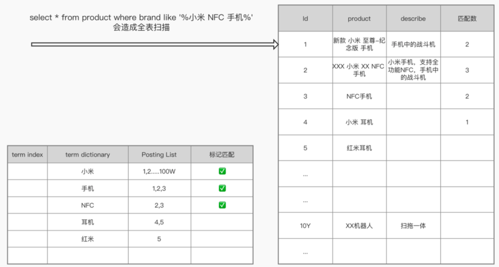
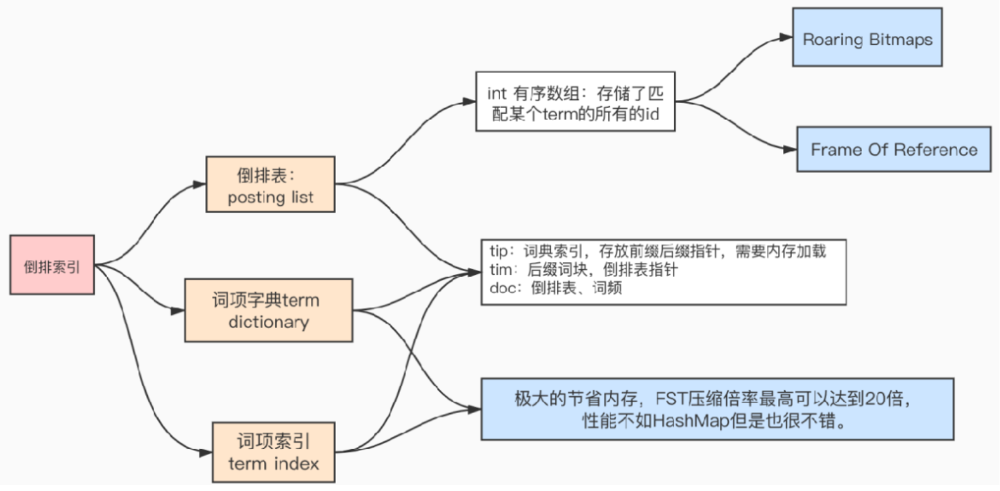
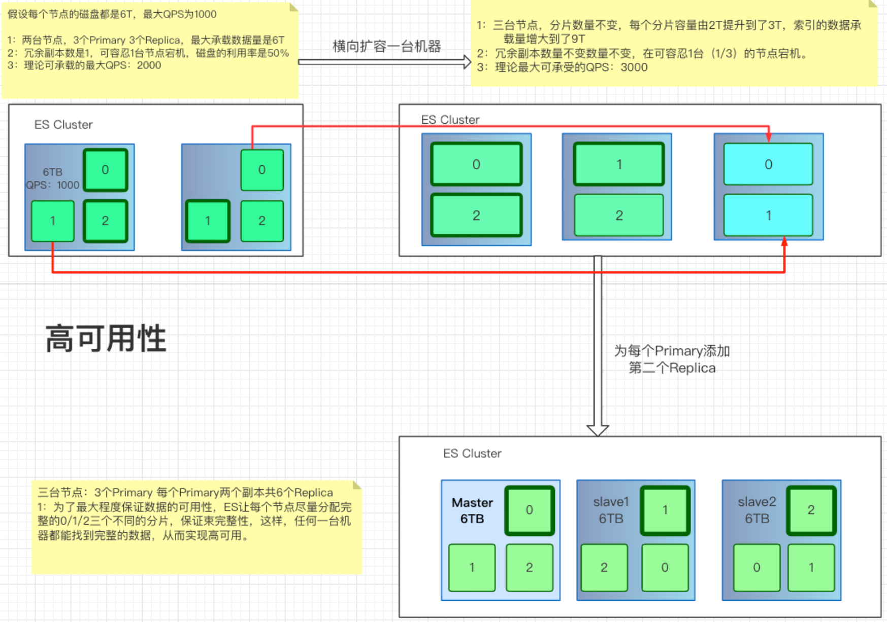

## ElasticSearch是什么？

ElasticSearch是由Java语言开发**基于Lucene**的一款开源的搜索、聚合分析的存储引擎，同时也可以称作是一种非关系型文档数据库。

### 特点：

- 分布式、高性能、高可用、易扩展、易维护
- 跨语言、跨平台：支持绝大多数主流编程语言，支持Windows、Linux和MacOS平台部署
- 支持结构化、非结构化、地理位置搜索等

### 使用场景

- 海量数据的全文检索，搜索引擎、垂直搜索、站内检索
- 数据分析和聚合查询
- 日志系统：ELK

## Mapping是什么？

ES中的mapping类似于RDB中“表结构”概念，在MySQL中，表结构包含字段名称、字段类型和索引等信息。在Mapping中也包含一些属性，比如字段名称、类型、字段使用的分词器、是否评分、是否创建索引等属性，并且ES中一个字段可以有多个类型。

## Term和Match有什么区别？

- term:对搜索不分词，不影响源数据
- match：对搜索分词，不影响源数据

## 倒排索引的核心原理

倒排索引：“关键词” =》 “文档ID”，即关键词到文件ID的映射

## 为什么ES不像MySQL采用B+ Tree的数据结构

B+ Trees左全文检索的弊端：

- 索引往往字段很长，如果使用B+ Trees,树可能很深，IO性能变差
- 性能无法保证并且索引会失效
- 精准度差（相关度低），并且无法和其他属性产生相关性

## 什么是字典树

Term Dictionary是字典序非重复的K-V结构的，而通常搜索引擎级别的倒排索引，Term
Dictionary动辄以“亿”起步，这要求我们在做数据存储时对其数据结构有极其高要求。所以在存储时，就必须要考虑如何以最小的代价换区最高的效率。考虑像Java开发过程中对代码的封装一样，重复利用公共内容！Lucene在存储这种有重复字符的数据的时候，只会存储一次，也就是哪怕有一亿个以abandon为前缀的词项，“abandon”这个前缀也只会存储一次。这里就用到了一种经常用到的一种数据结构：Trie即字典树，也叫前缀树（Prefix
Tree）。

## 分片副本的副作用

- 容灾
- 提高并发查询能力

## 谈一谈你对ES中索引的理解

索引在 ES 中所表述的含义和 MySQL 中的索引完全不同，在 MySQL 中索引指的是加速数据查询的一种特殊的数据结构，如 normal index。

而在 ES 中，索引表述的含义等价于 MySQL 中的表（仅针对 ES 7.x 以后版本），注意这里只是类比去理解，索引并不等于表.

索引的组成部分：

- alias：即索引别名，
- settings：索引设置，常见设置如分片和副本的数量
- mapping：即映射，定义了索引中包含哪些字段，以及字段的类型、长度、分词器等

ES中，索引在不同特定条件下表示三种不同含义：

- **表示源文件数据**：当做数据的载体，即类比为数据表，通常称作 index 。例如：通常说 集群中有 product 索引，即表述当前 ES
  的服务中存储了 product 这样一张“表”
- **表示索引文件**：以加速查询检索为目的而设计和创建的数据文件，通常承载于某些特定的数据结构，如哈希、FST
  等。例如：通常所说的正排索引和倒排索引（也叫正向索引和反向索引）。索引文件和源数据是完全独立的，索引文件存在的目的仅仅是为了加快数据的检索，不会对源数据造成任何影响
- **表示创建数据的动作**：通常说创建或添加一条数据，在 ES 的表述为索引一条数据或索引一条文档，或者 index 一个 doc
  进去。此时索引一条文档的含义为向索引中添加数据

## Master的选举过程

- **何时选举（触发条件）**
    - MasterFD节点发现Master节点失联
    - NodesFD（Active Master）节点发现当前集群中存活的master-eligible不满足法定票数

- **谁参与选举**
    - Active Master node：集群中存活的活跃主节点，正常情况下一个集群中仅允许有一个
    - master-eligible node：候选节点，一般指配置了maser角色的节点
    - Dedicated master-eligible node：专用主节点或候选节点，仅配置 master 一个角色，而没有配置其他角色的节点
    - voting-only：仅投票节点，一般指同时配置了master和voting_only的节点， 实际情况中，一般为仅投票节点同时配置data角色

## 脑裂是什么？如何解决？

- 何为脑裂：双主或多主
- 解决办法：discovery.zen.minimum_master_nodes = N/2 + 1，N为有效投票节点数

