## 为什么需要JVM，不要JVM可以吗？

- JVM可以屏蔽底层操作系统，一次编译，到处运行；
- JVM可以运行class文件

## 编译器到底做了什么？

编译器将`.java`文件转换成`.class`文件，实际上就是文件格式的转换，对等信息转换；

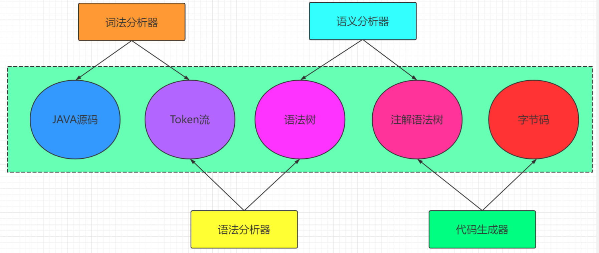

## 类加载机制

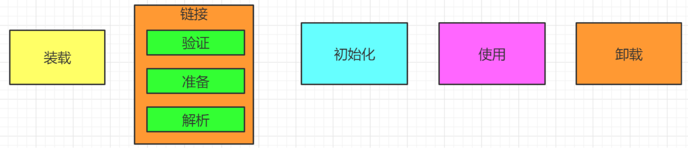

类加载机制就是虚拟机把Class文件加载到内存，并对数据校验，转换解析和初始化，形成虚拟机可以直接使用的Java类型，即`java.lang.Class`。

- 装载

  Class --> 二进制字节流 --> 类加载器
    - 通过类的全限定类名获取这个类的二进制字节流
    - 将这个字节流所代表的静态存储结构转换为方法区的运行时数据结构
    - 在Java堆中生成一个代表这个类的`java.lang.Class`对象，作为方法区的数据访问入口

- 链接
    - 验证：保证加载的类的正确性
        - 文件格式验证
        - 元数据验证
        - 字节码验证
        - 符号引用验证
    - 准备

      为类的静态变量分配内存，并将其初始化为当前类型的默认值；

      private static int a = 1; 在准备这个阶段 a = 0;
    - 解析

      解析是从运行时常量池中的符号引用动态却ing具体值的过程；把类中的符号引用转换成直接引用。
- 初始化

  执行到`Clinit`方法，为静态变量赋值，初始化静态代码块，初始化当前类的父类

## 类加载器的层次

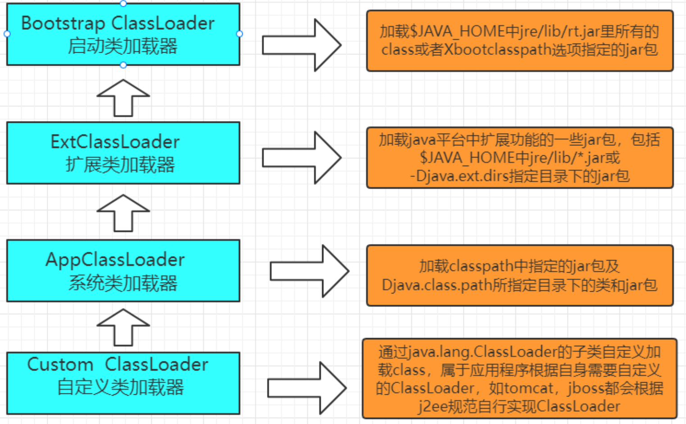

## 双亲委派机制

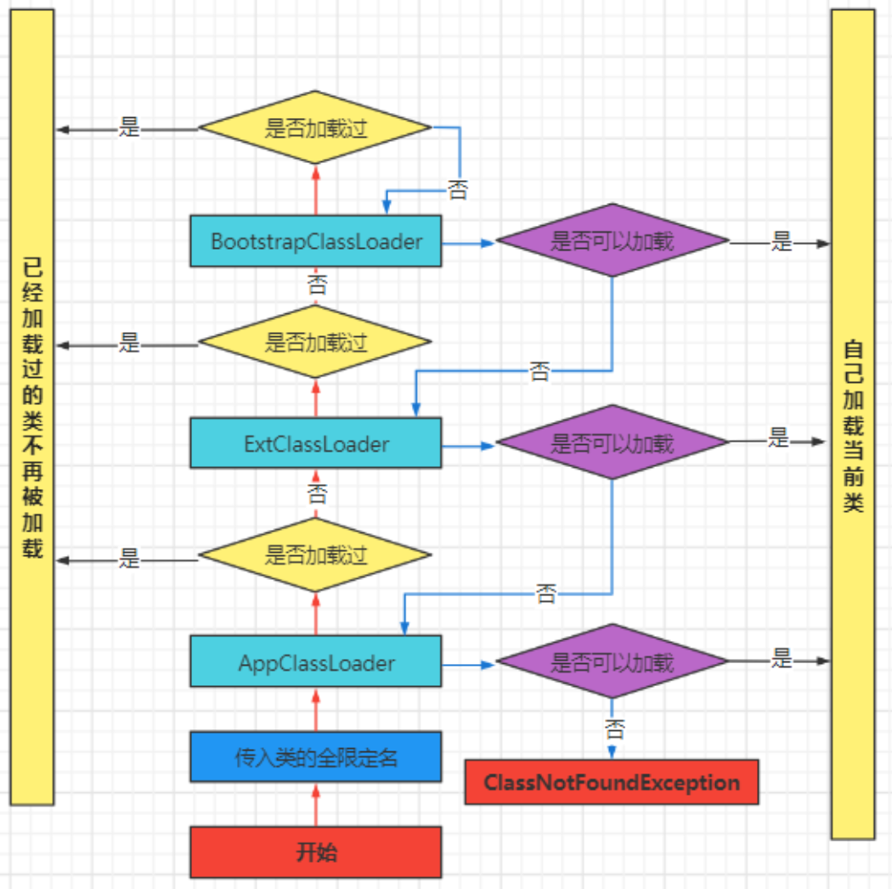

## 栈帧结构是什么样子？

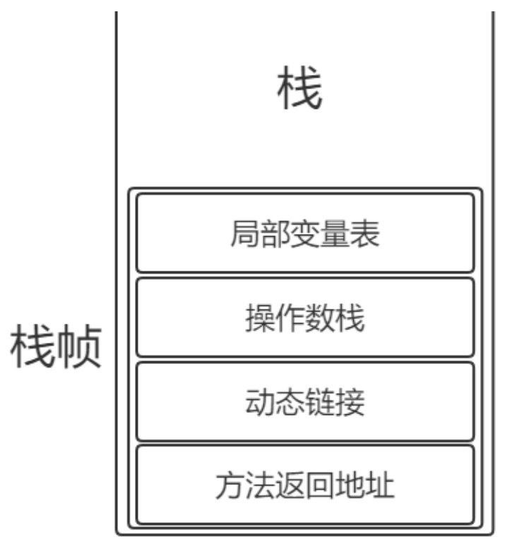

- 附加信息：栈帧的高度，虚拟机版本信息
- 栈帧信息：附加信息+动态链接+方法的返回地址
- 局部变量表：方法中定义的局部变量以及方法的参数都会存放在这张表中 ，单纯的存储单元
- 操作数栈： 以压栈以及出栈的方式存储操作数
- 方法的返回地址：当一个方法执行时，只有两种方式可以退出
    - 遇到方法的返回字节码指令
    - 出现异常，有异常处理器则交给异常处理器，没有则抛出异常

## java堆为什么要进行分代设计？

Java堆新老年代划分：

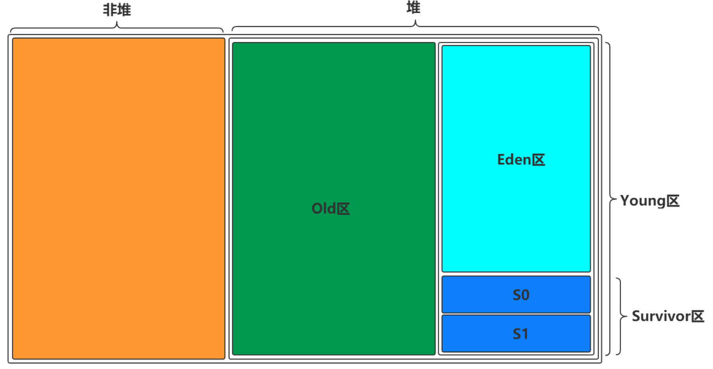

Eden区与S区

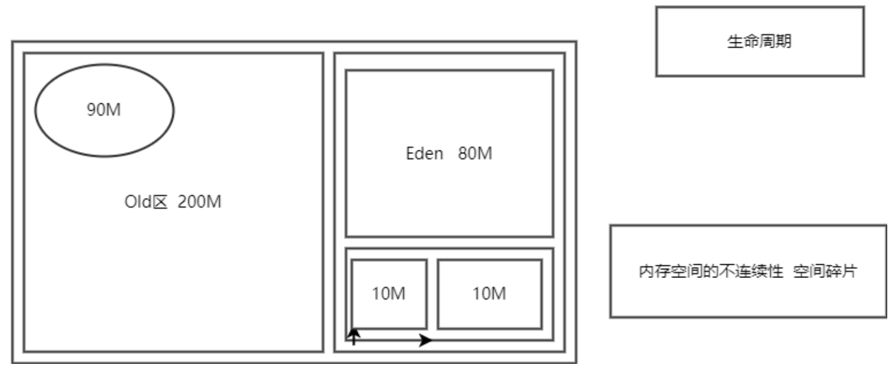

## 对象的创建过程

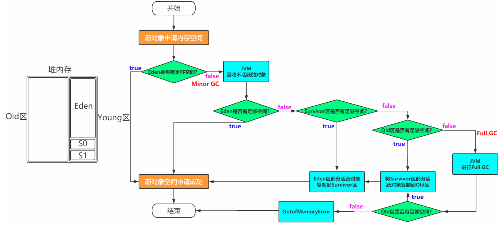

## 什么时候才会进行垃圾回收？

GC是由JVM自动完成的，根据JVM系统环境而定，所以时机是不确定的。
当然，我们可以手动进行垃圾回收，比如调用System.gc()方法通知JVM进行一次垃圾回收，但是
具体什么时刻运行也无法控制。也就是说System.gc()只是通知要回收，什么时候回收由JVM决
定。但是不建议手动调用该方法，因为GC消耗的资源比较大。

- 当Eden区或者S区不够用
- 老年代空间不够用
- 方法区空间不够用
- System.gc()    // 通知 时机也不确定，执行的是Full GC

## 如何确定一个对象是垃圾？

> 要进行垃圾回收，得先知道什么样的对象是垃圾

### 引用计数法

对于某个对象而言，只要应用程序中持有该对象的引用，就说明该对象不是垃圾，如果一个对象没有任何指针对其引用，它就是垃圾；

引用计数法缺点：如果AB相互持有引用，导致永远不可能回收。循环引用 内存泄露--> 内存溢出；

### 可达性分析/根搜索算法

**通过GC Root的对象，开始向下寻找，看某个对象是否可达**
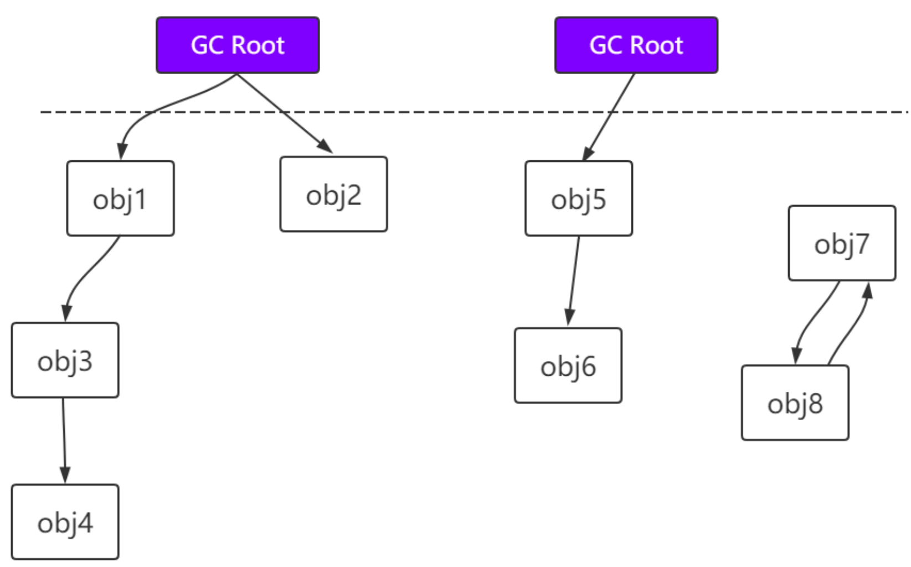

可以作为GC
Root：类加载器、Thread、虚拟机栈本地变量表、static成员、常量引用和本地方法栈的变量等。（虚拟机栈（栈帧中的本地变量表）中引用的对象；方法区中类静态属性引用的对象；方法区中常量引用的对象；本地方法栈中JNI（即一般说的Native方法）引用的对象）

## 对象被判定为不可达对象之后就“死”了吗

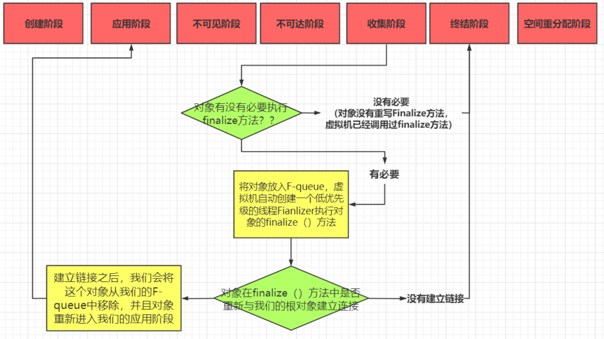

## 垃圾收集算法

确定一个对象为垃圾后，如何高效、健壮的回收对象：

### 标记-清除 (Mark-Sweep)

标记：找出内存中需要回收的对象，并且标记；此时堆中所有对象都会被扫描一遍，从而才能确定需要回收的对象，比较耗时。

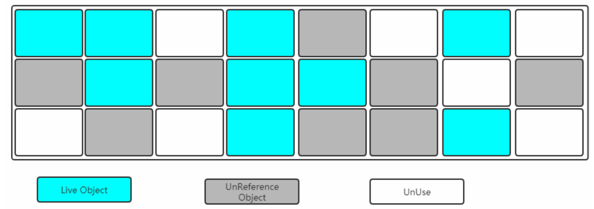

清除：清除掉被标记需要回收的对象，释放出对应的空间，如下：
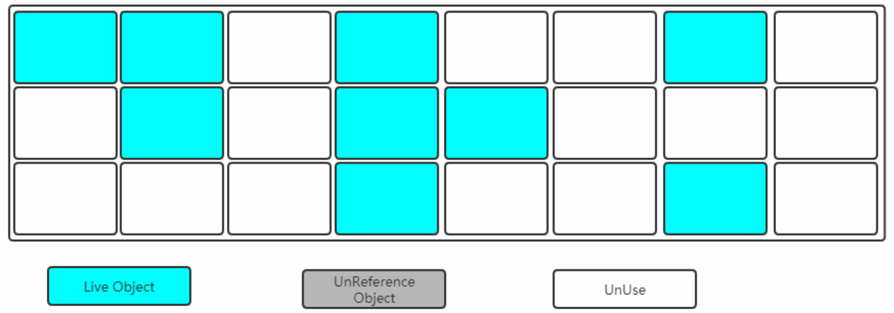

缺点：

- 标记清除后会产生大量不连续内存碎片，空间碎片太多可能导致程序运行过程中需要分配较大对象时，无法找到足够的连续内存而不得不触发另一次垃圾收集动作
- 标记和清除两个过程比较耗时，效率不高

### 标记-复制 (Mark-Copying)

将内存划分为两块相等的区域，每次只使用其中一块，如下：

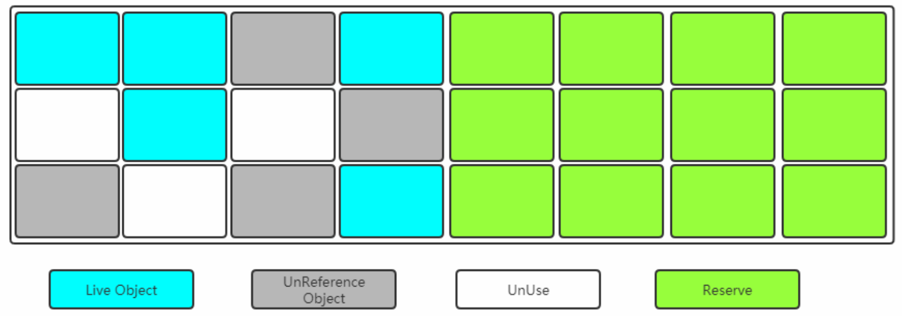

当其中一块内存使用完，就将还存活的对象复制到另外一块上，然后把已经使用过的内存空间一次清除掉。

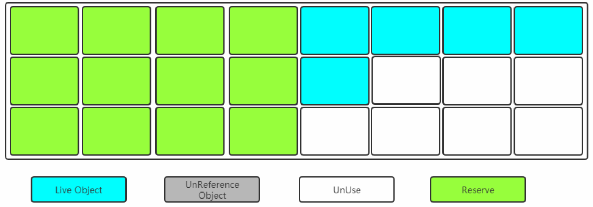

缺点：空间利用率低

### 标记-整理 (Mark-Compact)

> 复制收集算法在对象存活率较高时要进行比较多的复制操作，效率会变低。关键的是，如果不想浪费50%空间，就需要有额外的空间进行分配担保，以应对被使用的内存中所有对象都有100%存活的极端情况，所以老年代一般不能直接选用这种算法。

**标记过程仍然与"标记-清除"算法一样，但是后续步骤不是直接对可回收对象进行清理，而是让所有存活的对象都向一端移动，然后直接清理掉端边界以外的内存。
**

> 上述过程相对”复制算法“来讲，少了一个”保留区“

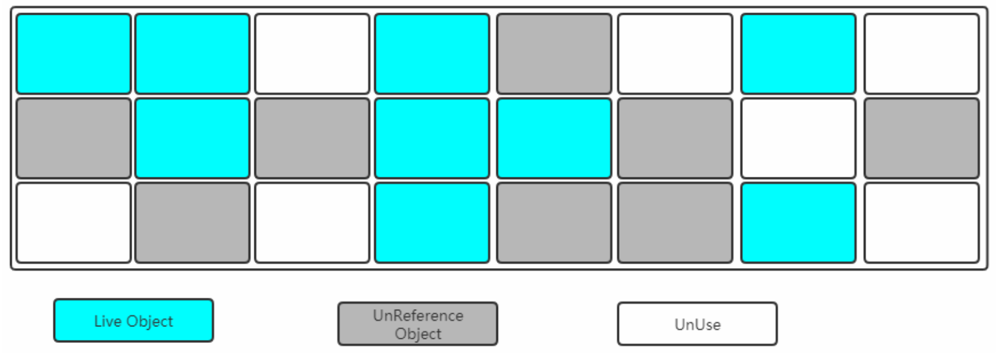

让所有存活对象都向一端移动，清理掉边界以外的内存。

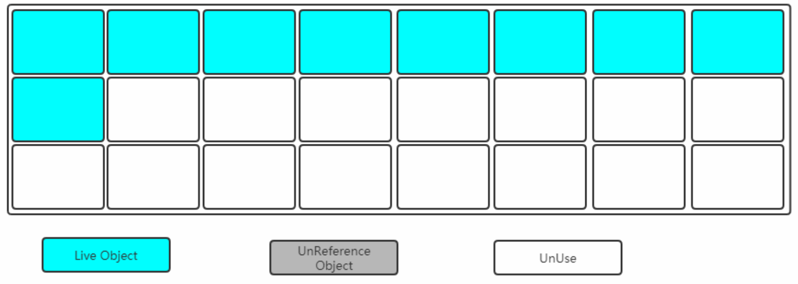

上面介绍了三种垃圾收集算法，那么在堆内存中如何选择？

- Young区：复制算法（对象在被分配前，可能生命周期比较短，Young区复制效率比较高）
- Old区：标记清除或标记整理（Old区对象存活时间比较长，复制来复制去没必要，不如做个标记再整理）

## 垃圾收集器

> 收集算法是内存回收的方法论，垃圾收集器是内存回收的具体实现。

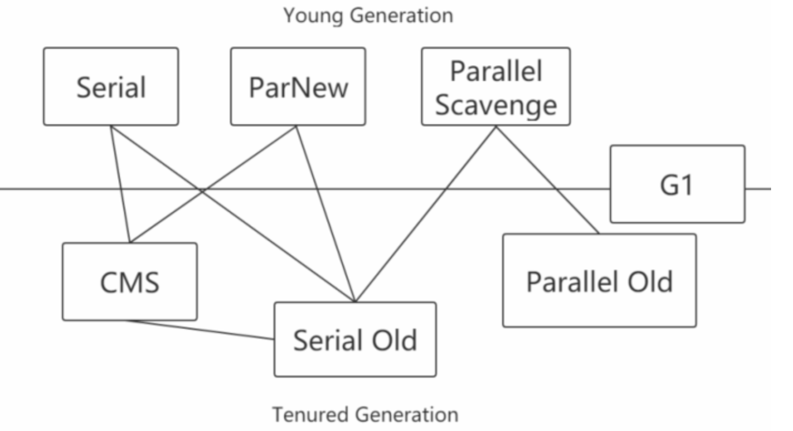

### Serial

Serial收集器是最基本、发展历史最悠久的收集器，在JDK1.3之前是虚拟机新生代收集器的唯一选择。

Serial是一种单线程收集器，不仅意味着只会使用一个CPU或者一条收集线程去完成垃圾收集工作，更重要的是在垃圾收集时需要暂停其他线程。

- 优点：简单高效，拥有很高的单线程收集效率
- 缺点：收集过程需要暂停所有线程
- 算法：复制算法
- 使用范围：新生代
- 应用：Client模式下的默认新生代收集器

### Serial Old

Serial Old收集器是Serial收集器的老年代版本，也是一个单线程收集器，不同的是采用"标记-整理算法"，运行过程和Serial收集器一样

### ParNew

可以把这个收集器理解为Serial收集器的多线程版本。

- 优点：多CPU时，比Serial效率高
- 缺点：收集过程暂停所有应用程序线程，单CPU时比Serial效率差
- 算法：复制算法
- 使用范围：新生代
- 应用：运行在Server模式下的虚拟机中首选的新生代收集器

### Parallel Scavenge

Parallel Scavenge收集器是一个新生代收集器，它也是使用复制算法的收集器，又是并行的多线程收集器，看上去和ParNew一样，但是Parallel
Scavenge更关注系统吞吐量

> 吞吐量 = 运行用户代码的时间/（运行用户代码的时间+垃圾收集时间）
>
>  比如虚拟机总共运行了100分钟，垃圾收集时间用了1分钟，吞吐量=(100-1)/100=99%。
>
>  若吞吐量越大，意味着垃圾收集的时间越短，则用户代码可以充分利用CPU资源，尽快完成程序的运算任务。

```text
-XX:MaxGCPauseMillis // 控制最大的垃圾收集器停顿时间
-XX:GCRatio          // 直接设置吞吐量的大小
```

### Parallel Old

Parallel Old收集器是Parallel Scavenge收集器的老年代版本，使用多线程和标记-整理算法进行垃圾回收，也是更加关注系统的吞吐量

### CMS

CMS（Concurrent Mark Sweep）收集器是一种以获取`最短回收停顿时间`为目标的收集器，采用”标记-清除“算法，整个过程分为4步：

- 初始标记 CMS initial mark // 标记GC Roots直接关联对象，不用Tracing，速度很快
- 并发标记 CMS concurrent mark // 进行GC Roots Tracing
- 重新标记 CMS remark // 修改并发标记因用户程序变量的内容
- 并发清除 CMS concurrent sweep // 清除不可达对象回收空间，同时有新垃圾产生，留着下次清理称为浮动垃圾

整个过程中，并发标记和并发清除，收集器线程可以与用户线程一起工作，所以总体上来说，CMS收集器的内存回收过程是与用户线程一起并发地执行的。

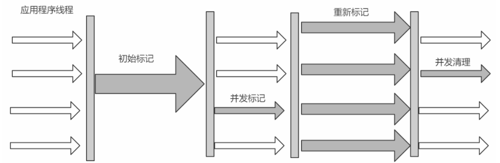

- 优点：并发收集、低停顿
- 缺点：产生大量空间碎片、并发阶段会降低吞吐量

### G1(Garbage-First)

使用G1收集器时，Java堆的内存布局与就与其他收集器有很大差别，它将整个Java堆划分为多个大小相等的独立区域（Region），虽然还保留有新生代和老年代的概念，但新生代和老年代不再是物理隔离的了，它们都是一部分Region（不需要连续）的集合。

- 每个Region大小都是一样的，可以是1M到32M之间的数值，但必须保证是2的n次幂
- 如果对象太大，一个Region放不下[超过Region大小的50%]，那么就会直接放到H中
- 设置Region大小：-XX:G1HeapRegionSize=M
- 所谓Garbage-First，就是优先回收垃圾最多的Region区域

（1）分代收集（仍保留了分代的概念）

（2）空间整合（整体上属于”标记-整理“算法，不会导致空间碎片）

（3）可预测的停顿（比CMS更先进的地方在于能让使用者明确指定一个长度为M毫秒的时间片段内，消耗在垃圾收集器上的时间不得超过N毫秒）

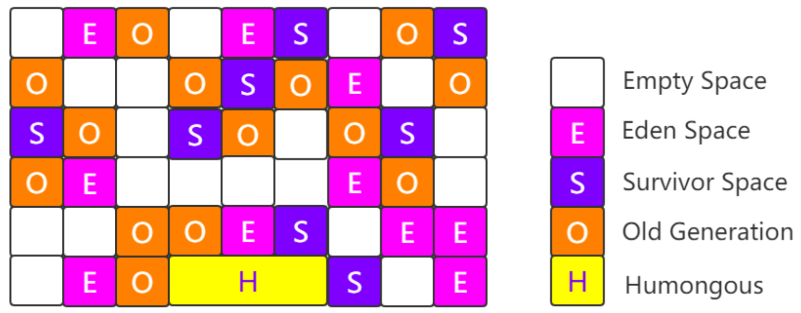

G1工作过程如下：

- 初始标记（Initial Marking），标记GC Roots能够关联的对象，并修改TAMS的值，需要暂停用户线程
- 并发标记（Concurrent Marking），从GC Roots进行可达性分析，找出存活的对象，与用户线程并发执行
- 最终标记（Final Marking），修正在并发标记阶段因为用户程序的并发执行导致变动的数据，需暂停用户线程
- 筛选回收（Live Data Counting and Evacuation），对各个Region的回收价值和成本进行排序，根据用户所期望的GC停顿时间制定回收计划

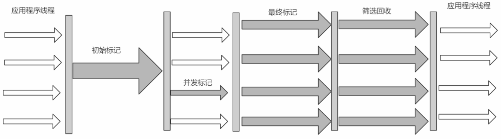 

### ZGC

JDK11新引入的ZGC收集器，不管是逻辑上还是物理上，ZGC中不存在新老年代的概念，转而分为一个个Page，当进行GC操作时会对Page进行压缩，因此没有碎片问题；

- 可以达到10ms以内的停顿时间要求
- 支持TB级别的内存
- 堆内存变大后停顿时间还是在10ms以内

## 垃圾收集器分类

- **串行收集器**（Seiral和Serial Old）

  只能有一个垃圾回收线程执行，用户线程暂停；适用于内存比较小的嵌入式设备

- **并行收集器**（吞吐量优先，Parallel Scanvenge/Parallel Old/ParNew）

  多条垃圾收集线程并行工作，但此时用户线程仍然处于等待状态；适用于科学计算、后台处理等交互场景

- **并发收集器**（停顿时间优先，CMS，G1，ZGC）

  用户线程和垃圾收集线程同时执行(但并不一定是并行的，可能是交替执行的)，垃圾收集线程在执行的时候不会停顿用户线程的运行；适用于相对时间有要求的场景，比如web。

## 生产环境中，如何选择合适的垃圾收集器

- 优先调整堆的大小让服务器自己来选择
- 如果内存小于100M，使用串行收集器
- 如果是单核，并且没有停顿时间要求，使用串行或JVM自己选
- 如果允许停顿时间超过1秒，选择并行或JVM自己选
- 如果响应时间最重要，并且不能超过1秒，使用并发收集器

## 如何判断是否使用G1垃圾收集器

JDK 7开始使用，JDK 8非常成熟，JDK 9默认的垃圾收集器，适用于新老生代；

是否适用G1收集器？

- 50%以上的堆被存活对象占用
- 对象分配和晋升的速度变化非常大
- 垃圾回收时间比较长

## JVM常用命令

- jps，查看Java进程
- jinfo，实时查看和调整JVM配置参数
    - jinfo -flag name PID 查看某个Java进程的name属性的值
  ```java
  jinfo -flag MaxHeapSize PID
  jinfo -flag UseG1GC PID 
  ```
    - 修改，参数只有被标记为manageable的flags可以被实时修改
  ```java
  jinfo -flag [+|-] PID
  jinfo -flag <name>=<value> PID
  ```
    - 查看曾经赋过值的一些参数
  ```java
  jinfo -flags PID
  ```
- jstat，查看虚拟机性能统计信息
    - 查看类装载信息
  ```java
  jstat -class PID 1000 10  查看某个Java进程的类装载信息，每1000毫秒输出一次，共输出10次
  ```
    - 查看垃圾收集信息

   ```java
    jstat -gc PID 1000 10
    ```

- jstack
    - 查看线程堆栈信息
    - 用法：`jstack PID`

- jmap，生成堆存储快照
    - jmap -heap PID，打印出堆内存相关信息

## G1调优策略

- 不要手动设置新生代和老年代的大小，只要设置整个堆的大小
  > G1收集器在运行过程中，会自己调整新生代和老年代大小，其实是通过adapt代大小来调整对象晋升速度和年龄，从而达到为收集器设置的暂停时间目标；如果手动设置了大小意味着放弃了G1的自动调优
- 不断调优暂停时间目标
  > 一般情况下这个值设置到100ms或者200ms都是可以的，但如果设置成50ms就不太合理。暂停时间设置的太短，会导致出现G1跟不上垃圾产生的速度。最终退化成Full
  GC。所以对这个参数的调优是一个持续过程，逐步调整到最佳状态。暂停时间只是一个目标，并不能总是得到满足。

- 使用-XX:ConcGCThreads=n来增加标记线程的数量
  > IHOP如果阀值设置过高，可能会遇到转移失败的风险，比如对象进行转移时空间不足。如果设置过低，就会使标记周期运行过于频繁，并且有可能混合收集期回收不到空间。
  IHOP值如果设置合理，但是在并发周期时间过长时，可以尝试增加并发线程数，调高ConcGCThreads。

- MixedGC调优
  > -XX:InitiatingHeapOccupancyPercent
  >
  > -XX:G1MixedGCLiveThresholdPercent
  >
  > -XX:G1MixedGCCountTarger
  >
  > -XX:G1OldCSetRegionThresholdPercent

- 适当增加堆内存大小
- 不正常的Full GC
  > 有时系统刚刚启动时，就会发生一次Full GC，但老年代空间比较充足，一般是由Metaspace区域引起的。可以通过MetaspaceSize适当增加其大家，比如256M。

## JVM性能优化指南

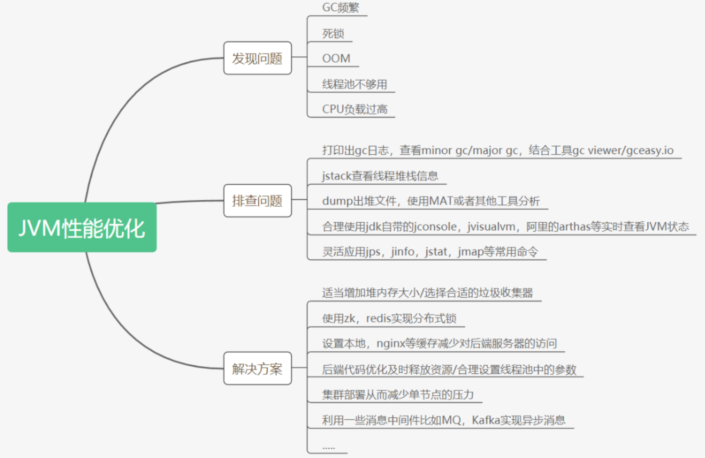
