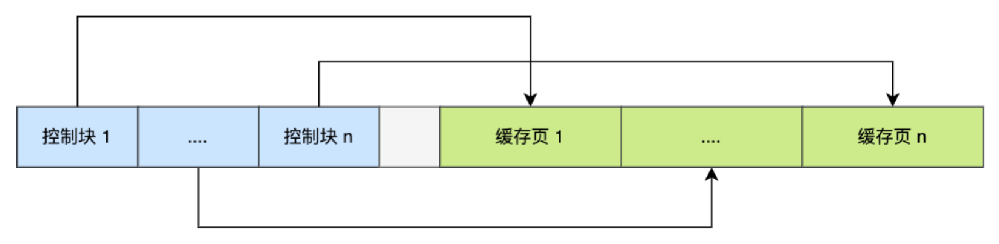
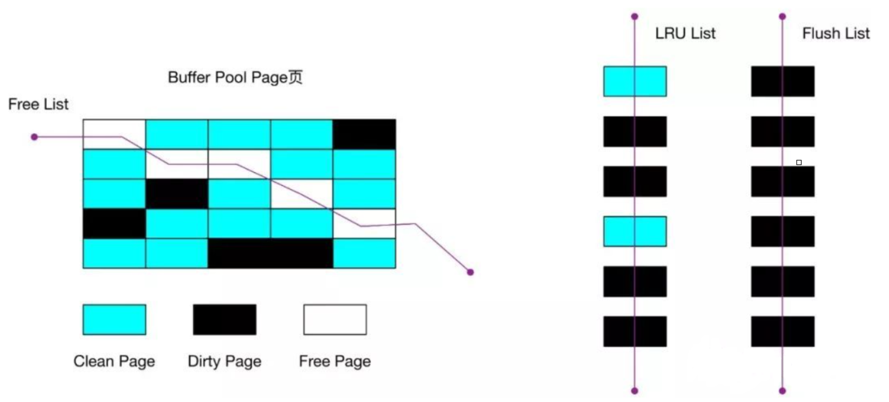
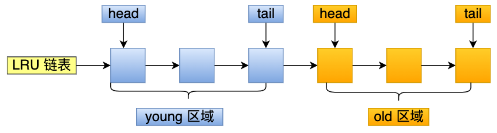

[toc]

## 一张表中有ID自增主键，当insert了17条记录后，删除第15，16和17条记录，接着重启MySQL，再次insert一条记录，这条记录的ID是18还是15？

- 如果表的类型是`MyISAM`，则为18，因为`MyISAM`表会把自增主键的最大ID记录到数据文件中，重启MySQL，自增主键的最大ID也不会丢失；
- 如果表的类型是`InnoDB`，则为15，`InnoDB`表只是把自增主键的最大ID存储到内存中，所以重启数据库或者对表进行操作，都会导致最大ID丢失；

## Heap 表是什么？

`heap`表存在于内存中，用于临时高速存储，需要注意：

- `BLOB`或`TEXT`字段不允许
- 只能使用比较运算符`=,<,>,>=,<=`
- `heap`表不支持`AUTO_INCREMENT`
- 索引不可为`NULL`

## 如何区分FLOAT和DOUBLE，CHAR_LENGTH和LENGTH？

### FLOAT和DOUBLE

- 浮点数以8位精度存储在`FLOAT`中，并且有4个字节
- 浮点数存储在`DOUBLE`中，精度为18位，有8个字节

### CHAR_LENGTH和LENGTH？

`CHAR_LENGTH`是字符数，而`LENGTH` 是字节数。`Latin`字符的这两个数据是相同的，但是对于`Unicode`和其他编码，它们是不同的.

####  

## 什么是BufferPool？

**缓冲池，简称BP，用来缓存表数据和索引数据，减少磁盘IO操作，提升效率。**

BP由**缓存数据页（Page）**和对缓存数据页进行描述的**控制块**组成，控制块中存储着对应缓存页所属的表空间、数据页的编号以及对应缓存页在BP中的地址等信息。

Buffer Pool默认⼤⼩是128M, 以Page⻚为单位，Page⻚默认⼤⼩16K，⽽ 控制块的⼤⼩约为数据⻚的5%，⼤ 概是800字节。


> Buffer Pool大小为128M指的就是缓存页的大小，控制块则一般占5%，所以每次多申请6M的内存空间用于存放控制块。

**如何判断一个页是否在BufferPool中缓存？**

MySQL中有一个哈希表数据结构，使用表空间号+数据页号，作为一个key，然后缓冲页对应的控制块作为value。

|        Key        |   Value    |
| :---------------: | :--------: |
| 表空间号+数据页号 | 对应控制块 |
| 表空间号+数据页号 | 对应控制块 |
|      ......       |   ......   |

- 当需要访问某个页数据时，先从哈希表中根据表空间号+页号看是否在对应的缓冲页
- 如果有，直接使用；如果没有，从free链表中选出一个空闲的缓冲页，然后把磁盘中对应的页加载到该缓冲页的位置

## InnoDB如何管理Page？

**BufferPool（BP）的底层采用链表数据结构管理Page。在InnoDB访问表记录和索引时会在Page页中缓存，以后使用可以减少磁盘IO操作，提升效率。**

Page根据状态可以分为三种类型：

- **free page** ，空闲page，未被使用
- **clean page** ，被使用page，数据没有被修改过
- **dirty page** ，脏页，被使用page，数据被修改过，page页中数据和磁盘数据产生了不一致

针对上面的三种page类型，InnoDB通过三种链表结构来维护和管理：

- **free list：** 空闲缓冲区，管理free page

  - free链表是把所有空闲的缓冲⻚对应的控制块作为⼀个个的节点放到⼀ 个链表中，这个链表便称之为free链表
  - 基节点: free链表中只有⼀个基节点是不记录缓存⻚信息(单独申请空 间)，它⾥⾯就存放了free链表的头节点的地址，尾节点的地址，还有 free链表⾥当前有多少个节点

- **flush list：** 要刷新到磁盘的缓冲区，管理dirty page，内部page按修改时间排序

  - InnoDB引擎为了提⾼处理效率，在每次修改缓冲⻚后，并不是⽴刻把 修改刷新到磁盘上，⽽是在未来的某个时间点进⾏刷新操作. 所以需要 使⽤到flush链表存储脏⻚，凡是被修改过的缓冲⻚对应的控制块都会作 为节点加⼊到flush链表

  - flush链表结构和free链表结构相似


- **lru list：** 正在使用的缓冲区，管理clean page和dirty page，缓冲区以midpoint为基点，前面链表称为new列表区，存放经常访问的数据，占63%，后面链表称为old列表区，存放使用较少数据，占37%。

## 为什么写缓冲区，仅适用于非唯⼀普通索引页？

**Change Buffer（CB）：写缓冲区，是针对⼆级索引(辅助索引) ⻚的更新优化措施。**

**作用：** 在进⾏DML操作时，如果请求的辅助索引（⼆级索引）没有在缓冲 池中时，并不会⽴刻将磁盘⻚加载到缓冲池，⽽是在CB记录缓冲变更，等 未来数据被读取时，再将数据合并恢复到BP中


- ChangeBuffer用于存储SQL变更操作，如`insert/update/delete`等SQL语句
- ChangeBuffer中的每个变更操作都有其对应的数据⻚，并且该数据⻚ 未加载到缓存中
- 当ChangeBuffer中变更操作对应的数据⻚加载到缓存中后，InnoDB会 把变更操作Merge到数据⻚上
- InnoDB会定期加载ChangeBuffer中操作对应的数据页到缓存中，并Merge变更操作

**Change Buffer更新流程：**


**写缓冲区，仅适用于非唯一普通索引页，为什么？**

如果在索引设置唯⼀性，在进⾏修改时，InnoDB必须要做唯⼀性校 验，因此必须查询磁盘，做⼀次IO操 作。会直接将记录查询到 BufferPool中，然后在缓冲池修改，不会在ChangeBuffer操作

## MySQL为什么改进LRU算法？

LRU = Least Recently Used（最近最少使用），新数据从链表头部加入，释放空间时从末尾淘汰。

### 普通LRU算法


- 当要访问某个⻚时，如果不在Buffer Pool，需要把该⻚加载到缓冲池, 并且把该缓冲⻚对应的控制块作为节点添加到LRU链表的头部
- 当要访问某个⻚时，如果在Buffer Pool中，则直接把该⻚对应的控制块 移动到LRU链表的头部 
- 当需要释放空间时,从最末尾淘汰

普通LRU算法优缺点：

- **优点：**

  所有最近使⽤的数据都在链表表头，最近未使⽤的数据都在链表表尾,保 证热数据能最快被获取到

- **缺点：**

  - 如果发⽣全表扫描（⽐如：没有建⽴合适的索引 or 查询时使⽤select * 等），则有很⼤可能将真正的热数据淘汰掉
  - 由于MySQL中存在**预读机制** ，很多预读的⻚都会被放到LRU链表的表 头。如果这些预读的⻚都没有⽤到的话，这样，会导致很多尾部的缓冲 ⻚很快就会被淘汰。

### 改进型LRU算法

将链表分为new和old两个部分，加⼊元素时并不是从表头插入，⽽是从中间`midpoint`位置插⼊(就是说从磁盘中新读出的数据会放在冷 数据区的头部)，如果数据很快被访问，那么page就会向new列表头部移 动，如果数据没有被访问，会逐步向old尾部移动，等待淘汰


冷数据区的数据⻚什么时候会被转到到热数据区呢 ?

- 如果该数据⻚在LRU链表中存在时间超过1s，就将其移动到链表头部 ( 链表指的是整个LRU链表) 
- 如果该数据⻚在LRU链表中存在的时间短于1s，其位置不变(由于全表扫 描有⼀个特点，就是它对某个⻚的频繁访问总耗时会很短)
- 1s这个时间是由参数 `innodb_old_blocks_time` 控制的

## 使用索引一定可以提升效率吗？

索引就是排好序的，可以快速查找的数据结构。索引就是⼀种将数据库中的记录按照特殊形式存储的数据结 构。通过索引，能够显著地提⾼数据查询的效率，从⽽提升服务器的性能。

**索引的优点：**

- 提⾼数据检索的效率,降低数据库的IO成本
- 通过索引列对数据进⾏排序,降低数据排序的成本,降低了CPU的消耗

**索引的缺点：**

- 创建索引和维护索引要耗费时间，这种时间随着数据量的增加⽽增加
- 索引占用物理空间，除数据表占用数据空间外，每个索引也占用一定物理空间
- 当对表中的数据进⾏增加、删除和修改的时候，索引也要动态的维 护，降低了数据的维护速度

**创建索引的原则：**

- 在经常需要搜索的列上创建索引，可以加快搜索的速度；
- 在作为主键的列上创建索引，强制该列的唯⼀性和组织表中数据的 排列结构；
- 在经常⽤在连接的列上，这些列主要是⼀些外键，可以加快连接的 速度；
- 在经常需要根据范围进⾏搜索的列上创建索引，因为索引已经排 序，其指定的范围是连续的
- 在经常需要排序的列上创建索引，因为索引已经排序，这样查询可 以利⽤索引的排序，加快排序查询时间；
- 在经常使⽤在WHERE⼦句中的列上⾯创建索引，加快条件的判断速 度

## 介绍⼀下Page⻚的结构？

Page是整个InnoDB存储的最基本构件，也是InnoDB磁盘管理的最⼩单 位，与数据库相关的所有内容都存储在这种Page结构⾥。Page分为几种类型：

- 数据页（B+tree Node）
- Undo页（Undo Log Page）
- 系统页（System Page）
- 事务数据页（Transaction System Page）


| 名称             | 占用大小 | 说明                                 |
| ---------------- | -------- | ------------------------------------ |
| File Header      | 38字节   | 文件头，描述页信息                   |
| Page Header      | 56字节   | 页头，页的状态                       |
| Infimum+Supremum | 26字节   | 最大和最小记录，这是两个虚拟的行记录 |
| User Records     | 不确定   | 用户记录，存储数据行记录             |
| Free Space       | 不确定   | 空闲空间，页中还没有被使用的空间     |
| Page Directory   | 不确定   | 页目录，存储用户记录的相对位置       |
| File Trailer     | 8字节    | 文件尾，检验页是否完整               |

- **File Header：** 记录Page的头信息，重要的是`FIL_PAGE_PREV`和`FIL_PAGE_NEXT`字段，通过这两个字段，可以找到该页的上一页和下一页，实际上所有页通过这两个字段可以形成一条双向链表；
- **Page Header：** 记录Page的状态信息
- **Infimum和Supremum：** 两个伪⾏记录，Infimum（下确界）记录⽐ 该⻚中任何主键值都要⼩的值，Supremum （上确界）记录⽐该⻚中 任何主键值都要⼤的值，这个伪记录分别构成了⻚中记录的边界；
- **User Records：** 存放实际的数据行记录
- **Free Space：** 存放的是空闲空间，被删除的⾏记录会被记录成空闲空间；
- **Page Directory：** 记录着与二叉查找相关的信息
- **File Trailer：** 存储⽤于检测数据完整性的校验和等数据

**页结构整体上可以分为三部分：通用部分（文件头、文件尾）、存储记录空间、索引部分。**

- **通用部分**

  主要指⽂件头和⽂件尾，将⻚的内容进⾏封装，通过⽂件头和⽂ 件尾校验的CheckSum⽅式来确保⻚的传输是完整的；⽐较重要的是在⽂件头中的 `FIL_PAGE_PREV` 和 `FIL_PAGE_NEXT` 字 段，通过这两个字段，可以找到该⻚的上⼀⻚和下⼀⻚，实际上所有⻚通过两个字段可以形成⼀条双向链表

- **记录部分（User Records&Free Space)**

  ⻚的主要作⽤是存储记录，所以“最⼩和最⼤记录”和“⽤户记录”部分占了⻚ 结构的主要空间。另外空闲空间是个灵活的部分，当有新的记录插⼊时， 会从空闲空间中进⾏分配⽤于存储新记录

- **数据目录部分（Page Directory）**

  数据页中行记录按照主键值由小到大顺序串联成一个单链表（页中记录是以单向链表形式存储的），且单链表的链表头为最⼩记录，链表尾为最 ⼤记录。并且为了更快速地定位到指定的⾏记录，通过 Page Directory 实现⽬录的功能，借助 Page Directory使⽤⼆分法快速找到需要查找的 ⾏记录。


## 说一下聚簇索引与非聚簇索引？

聚集索引与⾮聚集索引的区别是：叶节点是否存放⼀整⾏记录;

- **聚簇索引：** 将数据存储与索引放到了⼀块,索引结构的叶⼦节点保存了行数据
- **非聚簇索引：** 将数据与索引分开存储，索引结构的叶⼦节点指向了数据 对应的位置

InnoDB主键使用的是聚簇索引结构存储，MyISAM不管是主键索引还是二级索引使用的都是非聚簇索引。

### 聚簇索引

聚簇索引是⼀种数据存储⽅式，InnoDB的聚簇索引就是按照主键顺序 构建 B+Tree结构。B+Tree 的叶⼦节点就是⾏记录，⾏记录和主键值紧 凑地存储在⼀起。意味着InnoDB主键索引就是数据表本身，它按主键顺序存放整张表的数据，占用的空间就是整个表 数据量的大小，通常说的主键索引就是聚集索引。

- **InnoDB的表要求必须要有聚簇索引：**

  - 如果表定义了主键，则主键索引就是聚簇索引
  - 如果表没有定义主键，则第一个非空unique列作为聚簇索引
  - 否则InnoDB会从一个隐藏的row-id作为聚簇索引

- **辅助索引**

  InnoDB辅助索引，也叫作⼆级索引，是根据索引列构建 B+Tree结构。 但在 B+Tree 的叶⼦节点中只存了索引列和主键的信息。⼆级索引占⽤ 的空间会⽐聚簇索引⼩很多， 通常创建辅助索引就是为了提升查询效 率。⼀个表InnoDB只能创建⼀个聚簇索引，但可以创建多个辅助索 引


### 非聚簇索引

不同于InnoDB表存储，MyISAM使用非聚簇索引，非聚簇索引的两棵B+树看上去没什么不同，节点的结构完全一致只是存储的内容不同，主键索引B+树的结点存储了主键，辅助键索引B+树存储了辅助键。

表数据存储在独⽴的地⽅，这两颗B+树的叶⼦节点都使⽤⼀个地址指向真 正的表数据，对于表数据来说，这两个键没有任何差别。由于 索引树是独 ⽴的，通过辅助键检索⽆需访问主键的索引树


### 聚簇索引优点

- 当需要取出⼀定范围内的数据时，⽤聚簇索引也⽐⽤⾮聚簇索引好
- 当通过聚簇索引查找⽬标数据时理论上⽐⾮聚簇索引要快，因为⾮聚簇 索引定位到对应主键时还要多⼀次⽬标记录寻址,即多⼀次I/O
- 使⽤覆盖索引扫描的查询可以直接使⽤⻚节点中的主键值

### 聚簇索引的缺点

- 插⼊速度严重依赖于插⼊顺序
- 更新主键的代价很⾼，因为将会导致被更新的⾏移动 
- ⼆级索引访问需要两次索引查找，第⼀次找到主键值，第⼆次根据主键 值找到⾏数据

## 索引有哪几种类型？

### 普通索引

最基本的索引类型，基于普通字段建立的索引，没有任何限制；

```sql
CREATE INDEX <索引的名字> ON tablename (字段名);
ALTER TABLE tablename ADD INDEX [索引的名字] (字段名);
```

### 唯一索引

与"普通索引"类似，不同的就是：索引字段的值必须唯⼀，但允许有空值；

```sql
CREATE UNIQUE INDEX <索引的名字> ON tablename (字段名);
ALTER TABLE tablename ADD UNIQUE INDEX [索引的名字] (字段名);
```

### 主键索引

是⼀种特殊的唯⼀索引，不允许有空值。在创建或修改表时追加主键 约束即可，每个表只能有⼀个主键；

```sql
CREATE TABLE tablename ( [...], PRIMARY KEY (字段名) );
ALTER TABLE tablename ADD PRIMARY KEY (字段名);
```

### 复合索引

⽤户可以在多个列上建⽴索引，这种索引叫做组复合索引（组合索 引）。复合索引可以代替多个单⼀索引，相⽐多个单⼀索引复合索引所 需的开销更⼩.

```sql
CREATE INDEX <索引的名字> ON tablename (字段名1，字段名2...);
ALTER TABLE tablename ADD INDEX [索引的名字] (字段名1，字段名2...);
```

注意事项：

- 何时使⽤复合索引，要根据where条件建索引，注意不要过多使⽤ 索引，过多使⽤会对更新操作效率有很⼤影响
- 如果表已经建⽴了(col1，col2)，就没有必要再单独建⽴（col1）； 如果现在有(col1)索引，如果查询需要col1和col2条件，可以建⽴ (col1,col2)复合索引，对于查询有⼀定提⾼

### 全文索引

查询操作在数据量⽐较少时，可以使⽤like模糊查询，但是对于⼤量的⽂本 数据检索，效率很低。如果使⽤全⽂索引，查询速度会⽐like快很多倍.

MySQL5.6之前，只有MyISAM存储引擎支持全文索引，MySQL5.6开始MyISAM和InnoDB存储引擎均支持。

```sql
CREATE FULLTEXT INDEX <索引的名字> ON tablename (字段名);
ALTER TABLE tablename ADD FULLTEXT [索引的名字] (字段名);
CREATE TABLE tablename ( [...], FULLTEXT KEY [索引的名字](字段名) ;
```

全文索引方式有自然语言检索`IN NATURAL LANGUAGE MODE`和布尔检索`IN BOOLEAN MODE`两种，和常用的like模糊查询不同，全文索引有自己的语法格式，使用match和against关键字：

```sql
SELECT * FROM users3 WHERE MATCH(NAME) AGAINST('aabb');
-- * 表示通配符,只能在词的后⾯
SELECT * FROM users3 WHERE MATCH(NAME) AGAINST('aa*' IN BOOLEAN MODE);
```

注意事项：

- 全文索引必须再字符串、文本字段上建立
- 全⽂索引字段值必须在最⼩字符和最⼤字符之间的才会有效

## 介绍一下最佳左前缀法则？

如果创建的是联合索引,就要遵循该法则. 使⽤索引时， where后⾯的条件需要从索引的最左前列开始使⽤,并且不能跳过索引中的 列使⽤。

- **场景1：** 按照索引字段顺序使用，三个字段都是用了索引，没有问题

  ```sql
  EXPLAIN SELECT * FROM users WHERE user_name = 'tom' AND user_age = 17 AND user_level = 'A';
  ```

- **场景2：** 直接跳过user_name使⽤索引字段，索引⽆效，未使⽤到索引

  ```sql
  EXPLAIN SELECT * FROM users WHERE user_age = 17 AND user_level = 'A';
  ```

- **场景3：**不按照创建联合索引的顺序，使用索引

  ```sql
  EXPLAIN SELECT * FROM users WHERE user_age = 17 AND user_name = 'tom' AND user_level = 'A';
  ```

  where后⾯查询条件顺序是 user_age、user_level、user_name与 我们创建的索引顺序 user_name、user_age、user_level不⼀致， 为什么还是使⽤了索引，原因是因为MySql底层优化器对其进⾏了优 化

- **最佳左前缀底层原理：**

  MySQL创建联合索引的规则是: ⾸先会对联合索引最左边的字段进⾏排 序( 例⼦中是 user_name ), 在第⼀个字段的基础之上 再对第⼆个字段进 ⾏排序 ( 例⼦中是 user_age ) 


  最佳左前缀原则其实是和B+树的结构有关系, 最左字段肯定是有序的, 第 ⼆个字段则是⽆序的(联合索引的排序⽅式是: 先按照第⼀个字段进⾏排 序,如果第⼀个字段相等再根据第⼆个字段排序). 所以如果直接使⽤第⼆ 个字段 user_age 通常是使⽤不到索引的

## 什么是索引下推？

**索引下推（index condition pushdown），简称ICP，在MySQL5.6推出，用于优化查询。**

需求: 查询users表中 "名字第⼀个字是张，年龄为10岁的所有记录"

```sql
select * from users where user_name like "张%" and user_age = 10;
```

根据最佳左前缀法则，该语句在搜索索引树时，只能匹配到名字第一个字是”张“的记录，接下来怎么处理?

从该记录开始，逐个回表，到主键索引上找出相应的记录，再比对`age`这个字段的值是否符合。

在 (name,age) 索引⾥⾯特意去掉了 age 的值，这个过程 InnoDB 并 不会去看 age 的值，只是按顺序把“name 第⼀个字是’张’”的记录⼀条条取 出来回表。因此，需要回表 4 次


MySQL5.6引入索引下推优化，可以在索引遍历过程中，对索引中包含的字段先做判断，过滤掉不符合条件的记录，减少回表次数。


如果没有索引下推优化（ICP优化），当进行索引查询时，首先根据索引来查找记录，然后再根据where条件来过滤记录；

在支持ICP优化后，MySQL会在取出索引的同时，判断是否可以进行where条件过滤再进行索引查询，也就是提前执行where的部分过滤操作，某些场景下，可以大大减少回表次数，提升整体性能。

## 为什么LIKE以%开头索引会失效?

## ⾃增还是UUID？数据库主键 的类型该如何选择？

## InnoDB与MyISAM的区别？

## B树与B+树的区别？

## 一个B+树中大概能存放多少条索引记录？

## explain用过吗？有哪些主要字段？

## type字段中有哪些常见的值？

## Extra有哪些主要指标，各自的含义是什么？

## 如何进行分页查询优化？

## 如何做慢查询优化？

## Hash索引有哪些优缺点？

## 说⼀下InnoDB内存相关的参数优化？

## InnoDB⽇志相关的参数优化了解过吗？

## InnoDB IO线程相关参数优化了解过吗？

## 什么是写失效？

## 什么是行溢出？

## 如何进行JOIN优化？

## 索引哪些情况下会失效？

## 什么是覆盖索引？

## 介绍一下MySQL中事务的特性？

## MySQL中的可重复读怎么实现？

## Repeatable Read解决了幻读问题吗？

## 说一下数据库锁的种类？

## 说一下共享锁和排他锁？

## InnoDB的行锁怎么实现？

## 并发事务会产生哪些问题？

## 说一下MVCC内部细节

## 说一下MySQL死锁的原因和处理方法

## 介绍一下MySQL的体系架构

## undo log，redo log，bin log的作用是什么？

## redo log与undo log的持久化策略？

## bin log与undo log的区别？

## MySQL的binlog有几种日志格式？分别有什么区别？

## MySQL线上修改大表结构有哪些风险？

## count(列名)、count(1)和count(*)有什么区别？

## 什么是分库分表？什么时候进行分库分表？

## 说说MySQL的主从复制？

## 说⼀下MySQL 执⾏⼀条查 询语句的内部执⾏过程？

## MySQL内部支持缓存查询吗？

使用缓存的好处：当MySQL接收到客户端查询SQL后，仅仅需要对其相应的权限验证之后，就会通过Query Cache来查找结果，甚至不需要经过`Optimizer`模块进行执行计划的分析优化，更不需要发生任何存储引擎的交互。

**MySQL5.7支持内部缓存，8.0之后已经废弃**。原因如下：

- MySQL缺乏对缓存失效和生效的灵活管理，尤其对于频繁更新的表
- SQL必须完全一致才能命中缓存
- MySQL缓存在分库分表环境下不起作用
-  执⾏SQL⾥有触发器,⾃定义函数时，MySQL缓存也是不起作⽤的；
- 在表的结构或数据发⽣改变时，基于该表相关cache⽴即全部失效

替代方案：应用层组织缓存，使用Redis，memcached。


## MySQL的Buffer Pool
### 为什么要有Buffer Pool
MySQL的数据是存储在磁盘中，但如果每次从磁盘中读取数据，性能很差。MySQL为提升查询性能，InnoDB存储引擎设计了一个**缓冲池**，来提高数据库读写性能。

有了缓冲池后：
- 当读取数据时，如果数据存在于 Buffer Pool 中，客户端就会直接读取 Buffer Pool 中的数据，否则再去磁盘中读取。
- 当修改数据时，首先是修改Buffer Pool中数据所在的页，然后将其页设置为脏页，最后由后台线程将脏页写入到磁盘

#### 1. Buffer Pool有多大？
Buffer Pool是在MySQL启动时，向OS申请的一块连续内存空间，默认配置下 Buffer Pool 只有 128MB；
可以通过调整`innodb_buffer_pool_size`参数来设置Buffer Pool大小，一般建议设置成可用物理内存的60%~80%.
#### 2. Buffer Pool缓存什么？
InnoDB按页来划分, 把存储的数据划分为若干个【页】,以页作为磁盘和内存交互的基本单位，一个页的默认大小是16KB。

在 MySQL启动时，InnoDB 会为 Buffer Pool 申请一片连续的内存空间，然后按照默认16KB大小划分出一个个的页， Buffer Pool 中的页就叫做**缓存页**。此时这些缓存页都是空闲的，随着程序运行，磁盘上的页被缓存到 Buffer Pool 中。

所以，MySQL刚启动时，使用的虚拟内存空间很大，而使用到的物理内存空间很小，因为只有这些虚拟内存被访问后，OS才会触发缺页中断，接着将虚拟地址和物理地址建立映射关系。

Buffer Pool除了【索引页】和【数据页】，还包括undo页,插入缓存、自适应哈希索引、锁信息等.

为了更好的管理这些在Buffer Pool中的缓存页，InnoDB为每个缓存页创建了一个**控制块**，控制块信息包括：【缓存页的表空间、页号、缓存页地址和链表结点】等。控制块也是占用内存的，放在Buffer Pool最前边，接着是缓存页：


当查询一条记录时，InnoDB会把整个页的数据都加载到Buffer Pool中，因为通过索引只能定位到磁盘中的页，而不能定位到页中的一条记录，将页加载到Buffer Pool后，再通过页中的页目录定位到某条具体的记录。

### 如何管理Buffer Pool
#### 如何管理空闲页？
Buffer Pool是一块连续内存空间，MySQL运行一段时间后，缓存页中既有空闲的，也有被使用的，为了快速找到空闲的缓存页，可以使用链表结构，将空闲缓存页的【控制块】作为链表的结点，这个链表称为**Free链表**（空闲链表）

- Free 链表上除了有控制块，还有一个头节点，该头节点包含链表的头节点地址，尾节点地址，以及当前链表中节点的数量等信息
- Free链表结点是一个个控制块，且每个控制块包含着对应缓存页的地址，相当于Free链表结点都对应一个空闲的缓存页
- 有了Free链表后，每当需要从磁盘中加载一个页到Buffer Pool中时，就从Free链表中取一个空闲的缓存页，并把该缓存页对应的控制块信息填上，然后把该缓存页对应的控制块从Free链表中移除

#### 如何管理脏页？
Buffer Pool不仅可以提高读性能，也可以提高写性能，即更新数据时，不需要每次都写入磁盘，而是将Buffer Pool对应的缓存页标记为**脏页**，然后再由后台线程将脏页写入到磁盘。
为了能快速知道哪些缓存页是脏的，设计出了**Flush链表**，与Free链表类似，链表的结点也是控制块，区别在于Flush链表的元素都是脏页。


有了Flush链表之后，后台线程就可以遍历Flush链表，将脏页写入到磁盘。

#### 如何提高缓存命中率？（LRU）
Buffer Pool大小有限，对于频繁访问的数据希望一直留在Buffer Pool中，而很少访问的数据希望合适的时候淘汰，从而保证Buffer Pool不会因为满了导致无法再缓存新的数据，同时保证常用数据留在 Buffer Pool 中。
LRU算法：链表头部的节点是最近使用的，而链表末尾的节点是最久没被使用的。那么，当空间不够，就淘汰最久没被使用的节点。简单LRU算法实现思路如下：
- 当访问的页在 Buffer Pool 里，就直接把该页对应的 LRU 链表节点移动到链表的头部
- 当访问的页不在 Buffer Pool 里，除了要把页放入到 LRU 链表的头部，还要淘汰LRU链表末尾的节点

Buffer Pool中有三种页和链表来管理数据:


- Free Page(空闲页): 表示此页未被使用，位于 Free 链表
- Clean Page(干净页): 表示此页已被使用，但是页面未发生修改，位于LRU 链表
- Dirty Page(脏页): 表示此页「已被使用」且「已经被修改」，其数据和磁盘上的数据已经不一致.当脏页数据写入磁盘后，内存数据和磁盘数据一致，该页变为干净页，脏页同时存在于LRU链表和Flush链表

MySQL中并没有采用简单的LRU算法，因为简单LRU算法存在以下问题：

- 预读失效
- Buffer Pool 污染
> **MySQL预读机制：** 因为空间局部性原理，靠近当前被访问数据的数据，未来很大概率会被访问到，因此，MySQL加载数据页时，会把相邻的数据页一并加载，目的是减少磁盘IO。但可能被提前加载进来的数据页，并没有被访问，即预读失效。
> 
> 使用简单的LRU 算法，会把预读页放到LRU链表头部，而当Buffer Pool空间不够时，还要把末尾页淘汰，如果预读页一直不被访问，却占用了LRU链表前排位置，而末尾淘汰的页可能是频繁访问的页，如此，极大降低了缓存命中率。如何解决预读失效而导致缓存命中率降低的问题？
> 
> 要避免预读失效带来影响，最好就是让预读的页停留在 Buffer Pool 里的时间要尽可能的短，让真正被访问的页才移动到 LRU 链表的头部，从而保证真正被读取的热数据留在 Buffer Pool 里的时间尽可能长

MySQL采用改进LRU算法，将LRU划分为两个区域：**old区域和young区域**,young 区域在 LRU 链表的前半部分，old 区域则是在后半部分：


old 区域占整个 LRU 链表长度的比例可以通过`innodb_old_blocks_pc` 参数来设置，默认是 37，代表整个 LRU 链表中`young`区域与`old`区域比例是 63:37。划分这两个区域后，预读的页就只需要加入到 old 区域的头部，当页被真正访问的时候，才将页插入 young 区域的头部。如果预读的页一直没有被访问，就会从 old 区域移除，这样就不会影响 young 区域中的热点数据。

**通过划分 old 区域 和 young 区域避免了预读失效带来的影响.**
> **Buffer Pool污染：** 执行一个SQL语句扫描了大量数据，在Buffer Pool空间有限情况下，可能会将Buffer Pool中所有页替换出去，导致大量热数据被淘汰，热数据被再次访问时，由于缓存未命中，会产生大量磁盘IO，MySQL性能急剧下降，称之为Buufer Pool污染。
> 
> 怎么解决出现Buffer Pool污染而导致的缓存命中率下降的问题？
> 
> LRU 链表中 young 区域就是热点数据，只要我们提高进入到 young 区域的门槛，就能有效地保证 young 区域里的热点数据不会被替换掉。MySQL做法：进入到young区域条件增加了一个**停留在old区域的时间判断**。
> 在对某个处在 old 区域的缓存页进行第一次访问时，就在它对应的控制块中记录下来这个访问时间： 
> - 如果后续访问时间与第一次访问时间在某个时间间隔内，那么该缓存页就不会被从old区域移动到 young 区域的头部
> - 如果后续访问时间与第一次访问时间不在某个时间间隔内，那么该缓存页移动到young区域头部
> 
> 该时间间隔由`innodb_old_blocks_time`控制，默认是1000ms。
> 
> 也就是，**只有同时满足「被访问」与「在 old 区域停留时间超过 1 秒」两个条件，才会被插入到 young 区域头部，这样就解决了Buffer Pool污染问题**。同时，MySQL 针对 young 区域做了一个优化，为了防止 young 区域节点频繁移动到头部。young区域前面1/4被访问不会移动到链表头部，只有后面3/4被访问才会。

#### 脏页何时刷入磁盘？
当修改数据时，首先修改Buffer Pool中数据所在的页，然后将其页设置为脏页，但磁盘中还是原数据。因此需要将脏页中的数据刷入磁盘，保证缓存和磁盘数据的一致性，如果每次修改都刷盘，性能很差，所以一般选择定时批量刷盘。

这里可能会问 如果脏页数据没来得及刷盘，MySQL宕机，那不就丢失数据了？

InnoDB的更新操作采用的是`Write Ahead Log`策略，即先写日志，再写入磁盘，通过 redo log 日志让 MySQL 拥有了崩溃恢复能力。

下面情况会发生脏页数据的刷新：
- 当redo log日志满时，主动触发脏页刷新到磁盘
- Buffer Pool 空间不足时，需要将一部分数据页淘汰掉，如果淘汰的是脏页，需要先将脏页同步到磁盘
- MySQL认为空闲时，后台线程会定期将适量的脏页刷入到磁盘
- MySQL 正常关闭之前，会把所有的脏页刷入到磁盘

在开启了慢SQL监控后，如果你发现 **「偶尔」会出现一些用时稍长的 SQL** ，这可能是因为脏页在刷新到磁盘时可能会给数据库带来性能开销，导致数据库操作抖动。

如果间断出现这种现象，就需要调大 Buffer Pool 空间或 redo log 日志的大小
#### 总结
Buffer Pool以页为单位缓冲数据，可以通过`innodb_buffer_pool_size`参数调整缓冲池大小，默认是128MB，InnoDB通过三种链表管理缓存页：
- Free List（空闲页链表），管理空闲页
- Flush List （脏页链表），管理脏页
- LRU List，管理脏页+干净页，将最近且经常查询的数据缓存在其中，而不常查询的数据就淘汰

InnoDB对LRU进行了优化，简单LRU算法通常是将最近查询的数据放到LRU链表头部，而InnoDB做了如下：
- 将LRU链表分为young和old两个区域，加入缓冲池的页，优先插入old区域；页被访问时，才进入young 区域，目的是为了解决预读失效问题
- 当「页被访问」且「 old 区域停留时间超过`innodb_old_blocks_time`阈值（默认为1秒）」时，才会将页插入到 young 区域，否则还是插入到 old 区域，目的是为了解决批量数据访问，大量热数据淘汰的问题

可以通过调整`innodb_old_blocks_pc`参数，设置young区域和old区域比例

在开启了慢SQL监控后，如果发现「偶尔」会出现一些用时稍长的 SQL，这可因为脏页在刷新到磁盘时导致数据库性能抖动。如果在很短时间出现这种现象，就需要调大 Buffer Pool 空间或 redo log 日志的大小