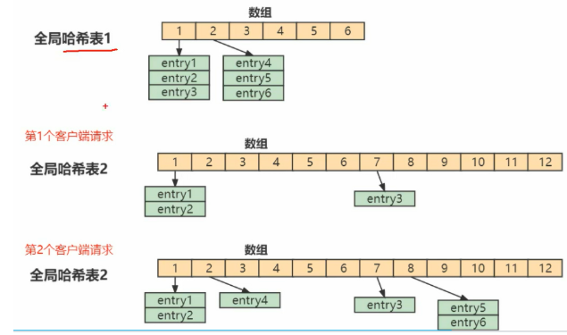

[toc]

## 1. Redis为什么很快?

- **纯内存访问**

  Redis操作基于内存，CPU不是Redis性能瓶颈，Redis瓶颈是机器内存和网络带宽；CPU速度远大于内存速度，同时内存速度也是远大于硬盘速度；

- **单线程避免上下文切换**

  单线程可以省去多线程时上下文切换的时间，也无需考虑各种锁的问题，不存在加锁，释放锁，没有死锁问题导致的性能消耗。对于内存系统，多次读写都是在一个CPU上，没有上下文切换效率很高。

- **渐进式ReHash，缓存时间戳**

- **I/O多路复用**，为什么Redis使用I/O多路复用这种技术？

  Redis是单线程的，所有操作都是按顺序线性执行，但由于读写操作等待用户输入或输出都是阻塞的，所以I/O操作一般情况下往往不能直接返回，这会导致某一文件的I/O阻塞导致整个进程无法对其他客户提供服务，而I/O多路复用就是为了解决这个问题提出的。

- **Reactor设计模式**

  Redis基于Reactor模式开发了自己的网络事件处理器，称之为文件事件处理器

### 1.1 渐进式rehash

Redis采用渐进式rehash。首先，Redis默认使用两个全局哈希表：哈希表1和哈希表2，开始时，刚插入数据时，默认使用哈希表1，此时的哈希表2并没有被分配空间，随着数据逐渐增多，redis开始执行rehash

- 给哈希表2分配更大的空间，例如是当前哈希表1大小的两倍
- 把哈希表1中的数据重新映射并拷贝到哈希表2中
- 释放哈希表1的空间

上面的第二步涉及大量的数据拷贝，如果一次性把哈希表1中的数据都迁移完，会造成Redis线程阻塞，无法服务其他请求。此时，Redis就无法快速访问数据了。

Redis开始执行rehash，redis仍能正常处理客户端请求，但需要假如一个额外的处理：

处理第一个请求时，把哈希表1中的第1各索引位置上的所有entries拷贝到哈希表2中

处理第2个请求时，把哈希表1中的第2个索引位置上的所有entries拷贝到哈希表2中

如此循环，直到把所有索引位置的数据都拷贝到哈希表2中。

这样，就巧妙把一次性大量拷贝的开销，分摊到了多次处理请求的过程中，避免了耗时操作，保证了数据的快速访问。这里基本上也可以确保根据key找value的操作在O(
1)左右

需要注意的是，如果Redis中有海量的key，这个Rehash过程会很长，虽然采用渐进式Rehash，但在Rehash过程中还是会导致请求有不小的卡顿。按照Redis配置每个实例能存储最大的key的数量为2的32次方，即2.5亿，但尽量把key的数量控制在千万以下，这样就可以避免Rehash导致的卡顿问题，如果数量确实比较多，建议采用分区hash存储。

### 1.2 缓存时间戳

使用系统时间戳，经常使用`System.currentTimeInMillis`或者`time.time()`
来获取系统毫秒时间戳。Redis不能如此，因为每次获取系统时间戳都是依次系统调用，系统调用相对来说比较耗费时间，作为单线程的Redis承受不起，所以需要对时间进行缓存，由一个定时任务，每毫秒更新一次时间缓存，获取时间都是从缓存中直接取